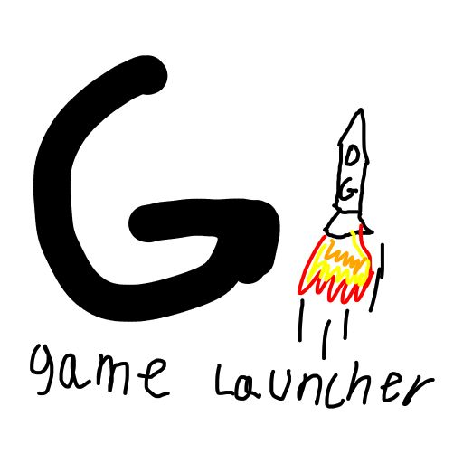

# Game Launcher
 Mel's game launcher

## To-do
- [ ] Improve game automatic detection for launch.dat
- [ ] Play time counter
- [ ] Make uninstall work
- [ ] Save file management and quick swapping
- [ ] Add auto-updating
- [ ] Possibly add game source providing
- [ ] Fix dir names feature
- [ ] Note unrecognized games
- [ ] Add splash screen

## Recently added

- Fixed workingdir issue causing some games to start
- Added offline mode
- Added folder select when scan dir is inaccessible
- Scan dir now configurable
- Added metadata overriding
- Increased IGDB database reliability
- File restructure
- Progress bar moved out of the way
- Fixed crash when refreshing metadata in detail view
- Added settings
- Added bad themes (WIP)
- Added IGDB setup screen
- Discord RPC support
- External game process attachment
- Manually add games
- Rate limiting protection
- New icon (from nothing)